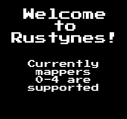

# RustyNES

An NES emulator written in Rust!

https://user-images.githubusercontent.com/31429425/136135867-dcd07b5e-8dd4-4862-9bb5-18d45d7a7789.mp4


## Supported Mappers
* Mapper 0
* Mapper 1
* Mapper 2

A list of all NES games and their associated mappers can be found <a href="http://tuxnes.sourceforge.net/nesmapper.txt">here</a>.

## Usage
The lastest versions of RustyNES for Ubuntu, macOS, and Windows can be found under Releases.

Games can be loaded in two different ways. 

### No Args
If you run the binary/executable with no args, the following splash screen will appear.



Simply drag-and-drop the .nes file into the window and start playing!

### Load a Specific ROM
If you would like to load a .nes file at launch, you can use the following argument:
```
./rustynes --rom=/path/to/rom.nes
```
or 
```
./rustynes -r=/path/to/rom.nes
```

### Controls
<table>
  <tr>
    <th>Key</th>
    <th>Function</th>
  </tr>
  <tr>
    <td>Enter</td>
    <td>NES Start</td>
  </tr>
  <tr>
    <td>Right Shift</td>
    <td>NES Select</td>
  </tr>
  <tr>
    <td>Z</td>
    <td>NES A</td>
  </tr>
  <tr>
    <td>X</td>
    <td>NES B</td>
  </tr>
  <tr>
    <td>Arrow Keys</td>
    <td>NES D-pad</td>
  </tr>
  <tr>
    <td>I</td>
    <td>Displays a pop-up with the controls.</td>
  </tr>
  <tr>
    <td>Esc</td>
    <td>Exits to splash screen. If already on splash screen, exits the emulator.</td>
  </tr>
</table>

## Building on Linux and macOS
In order to build RustyNES, you will need SDL2 bindings for Rust. The base SDL2 bindings can be found <a href="https://github.com/Rust-SDL2/rust-sdl2">here.</a> You will also need the SDL_Image and SDL_gfx packages.
Ubuntu/Mint:
```
sudo apt install libsdl2-gfx-dev
sudo apt install libsdl2-image-dev
```
macOS:
```
brew install libsdl2-gfx-dev
brew install libsdl2-image-dev
```
Once the libraries are installed, you should be able to build a binary by running the following command in the root of your RustyNES repository: 
```
cargo build --release
```

### Building on Windows
On Windows, building RustyNES is a little more complex. First, you'll need to run the following command in Command Prompt or Powershell:
```
rustup target add i686-pc-windows-msvc
```
This will allow you to build a 32-bit executable of RustyNES. Unfortunately, only 32-bit builds are supported right now, as I only have a 32-bit build of SDL_gfx.

Following the Windows instructions outlined here <a href="https://github.com/Rust-SDL2/rust-sdl2">here</a> to install SDL2. You will also need SDL_Image and SDL_gfx. 32-bit SDL_Image libraries can be downloaded <a href="https://www.libsdl.org/projects/SDL_image/">here</a>, but SDL_gfx is more complex. SDL_gfx libraries were never released for Windows, but the creator did release the source code which I was able to compile with MSVC. I uploaded the SDL_gfx .lib and .dll files, as well as necessary supporting .dll files, to <a href="https://www.dropbox.com/sh/tmzw9yseh3voie7/AADYmemWPv45N94fSCW--rU3a?dl=0">Dropbox</a>. Place both the SDL_Image and SDL_gfx .lib/.dll files in the following directory:
```
C:\Users\{YOUR USERNAME}\.rustup\toolchains\stable-x86_64-pc-windows-msvc\lib\rustlib\i686-pc-windows-msvc\lib
```

Now you're ready to go! To create an executable, simply run this command in the root of your RustyNES repository:
```
cargo build --release --target=i686-pc-windows-msvc
```
**Note**: To properly run the executable, the following .dll files must be in the same directory as the executable:
* libjpeg-9.dll
* libpng16-16.dll
* SDL2.dll
* SDL2_gfx.dll
* SDL2_image.dll
* zlib1.dll

All of these files can be downloaded from the Dropbox link above.
